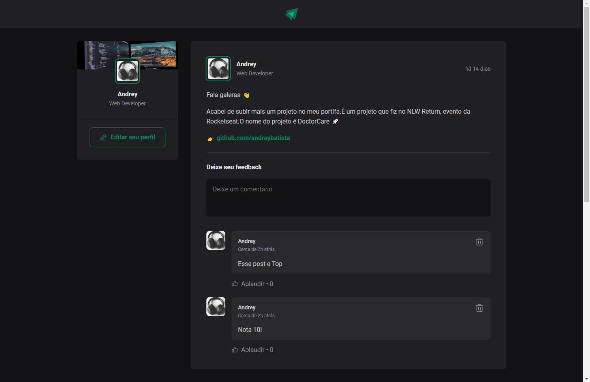

<h1 align="center"> Feed </h1>

## Getting Started

Primeiro, execute os comandos:

```bash
npm i

npm run dev
```

<p align="center">
  <a href="#-tecnologias">Tecnologias</a>&nbsp;&nbsp;&nbsp;|&nbsp;&nbsp;&nbsp;
  <a href="#-projeto">Projeto</a>&nbsp;&nbsp;&nbsp;|&nbsp;&nbsp;&nbsp;
  <a href="#-layout">Layout</a>&nbsp;&nbsp;&nbsp;|&nbsp;&nbsp;&nbsp;
  <a href="#memo-licença">Licença</a>
</p>

<br>

<p align="center">
  
</p>

## 🚀 Tecnologias

Esse projeto foi desenvolvido com as seguintes tecnologias:

- React | Vite
- Typescript

## 💻 Projeto

A página tem como função simular o feed de uma rede social, listando os posts e comentários, podem simular um comentário a algum post, projeto responsivo para ser usado em qualquer dispositivo.

## 🔖 Layout

Você pode visualizar o layout do projeto através [DESSE LINK](https://www.figma.com/file/wyqsVnMxaavUmC3CHNSLSx/Ignite-Feed-(Community)?node-id=0%3A1&t=rNt1b1BN8ZetAedS-1). É necessário ter conta no [Figma](https://figma.com) para acessá-lo.


---

Projeto desenvolvido durante as aulas do Ignit da Rocketseat